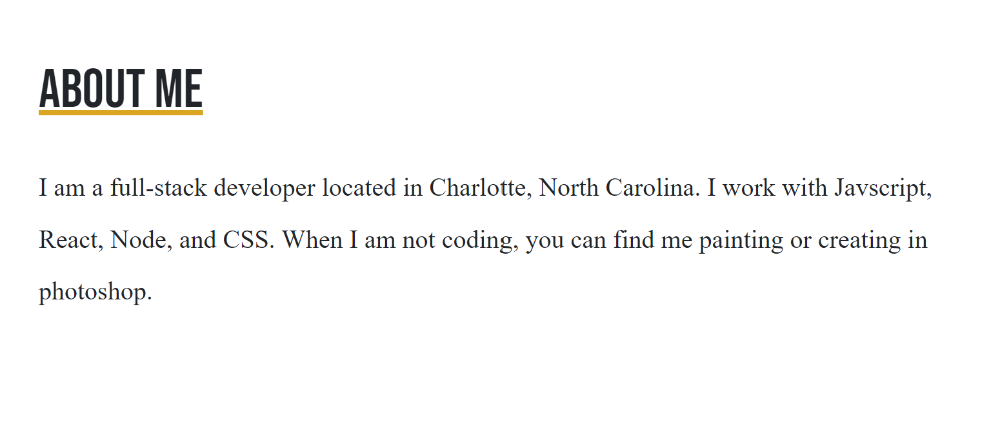
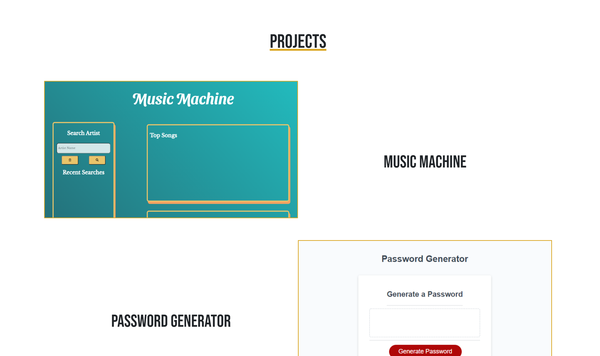

# Portfolio-Take-One
An online portfolio built to display my work

Link to the live site: 
https://angeleefshaw.github.io/angelee-shaw-fullstack-portfolio/

# Description
Welcome to my Full-stack portfolio. This page allows others to see current projects and read about my experience as a developer. A brief description of my programming background can be found in the 'About' section. Also included, are projects that challenge my understanding of Javascript and CSS. 

This portfolio is updated regularly as I broaden my understanding of web development. 

# Demo 

The section titled "About Me" shares a bit about my interest and background. 

You will find a few of my recent projects under the section titled "Projects". Click on a project for live viewing. 

# The Code
This page features CSS and HTML

# License
Angelee Shaw's Portfolio is released under an MIT License 
